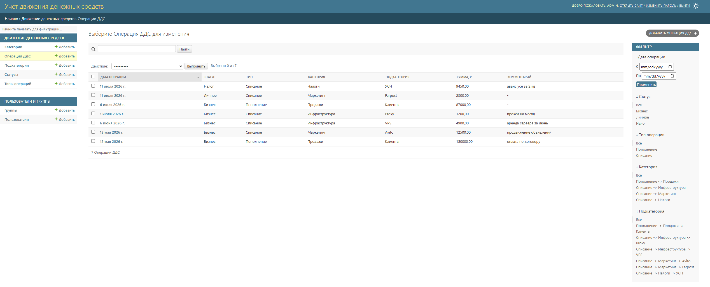
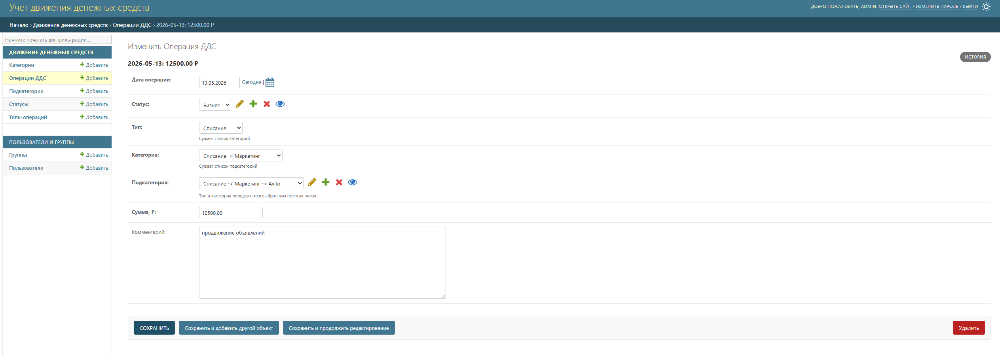
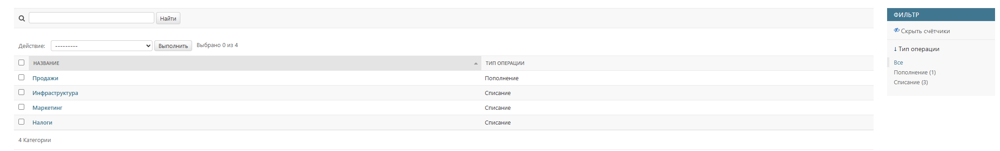
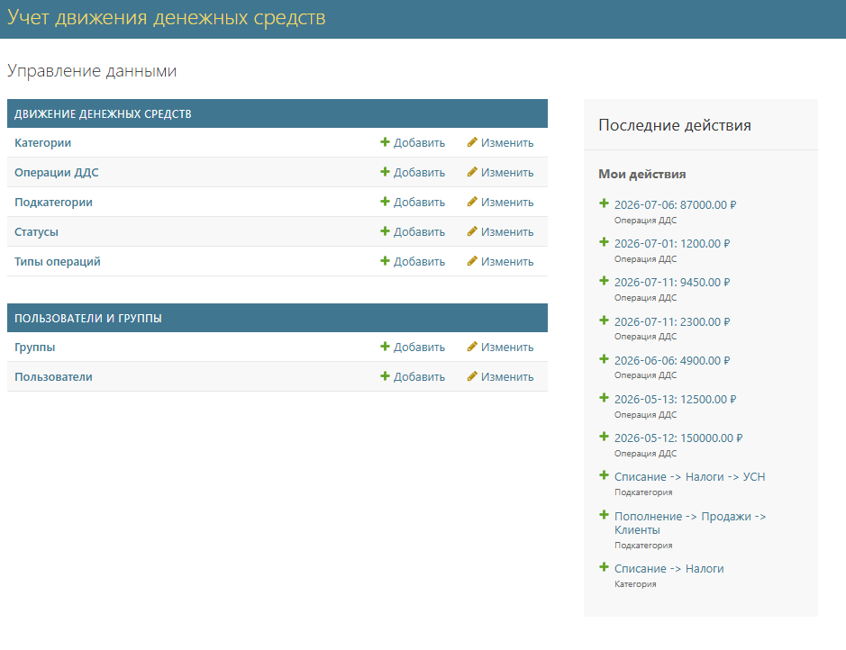

# Учет движения денежных средств

Тестовое задание. Веб-приложение для учета поступлений и списаний денег.
Интерфейс сделан на стандартной Django admin, свой фронтенд не писал, потому что
админка закрывает все требования: CRUD записей, фильтры, справочники. Для
программного доступа есть небольшой REST API на DRF.

## Модель данных

Иерархия справочников: тип операции -> категория -> подкатегория.

Запись хранит только ссылку на подкатегорию, категория и тип вычисляются через
нее. За счет этого запись с категорией не от того типа сохранить нельзя в
принципе, неправильной комбинации просто не существует. Статус отдельным
справочником.

Нюансы:

- если перевесить категорию под другой тип, старые записи переклассифицируются
  вместе с ней, история изменений не хранится
- элементы справочников, на которые ссылаются записи, удалить нельзя (PROTECT),
  сначала надо удалить или перевести сами записи

## Запуск

Нужен Python 3.12 или новее.

Windows (PowerShell):

```powershell
py -m venv .venv
.\.venv\Scripts\Activate.ps1
pip install -r requirements.txt
python manage.py migrate
python manage.py createsuperuser
python manage.py runserver
```

На Linux/macOS то же самое, только `python3 -m venv .venv` и
`source .venv/bin/activate`.

Эндпойнты:

- http://127.0.0.1:8000/ - редирект на список операций
- http://127.0.0.1:8000/admin/ - админка и справочники
- http://127.0.0.1:8000/api/entries/ - API

Миграции сразу создают статусы (Бизнес, Личное, Налог), типы (Пополнение,
Списание) и примеры категорий с подкатегориями, так что потыкать можно сразу.

## Как пользоваться

Зайти под суперпользователем, открыть "Операции ДДС", создать запись. Дата
подставляется сегодняшняя, можно поменять. Селекты типа и категории в форме
фильтруют список подкатегорий (небольшой js), сохраняется только подкатегория,
на сервере согласованность проверяется еще раз. Комментарий необязательный.

В списке операций есть поиск и фильтры: период дат, статус, тип, категория,
подкатегория. Справочники редактируются в той же админке.

Сумма - положительное число в рублях, копейки через точку. Направление
определяется типом операции, отрицательных сумм нет.

## API

Авторизация сессионная, доступ есть только у staff-пользователей. Логин тот же,
что в админке.

- GET /api/entries/ - список с пагинацией
- POST /api/entries/, PUT/PATCH/DELETE /api/entries/<id>/ - создание и правка

Фильтры через query-параметры: date_from, date_to, status, type, category,
subcategory (справочники по id). Категория и тип в ответе только для чтения,
считаются от подкатегории.

## Тесты и проверки

```bash
python manage.py check
python manage.py makemigrations --check --dry-run
python manage.py test
```

## Настройки

По умолчанию DEBUG=1 и дефолтный небезопасный SECRET_KEY, для локальной работы
хватает. Переопределяются переменными окружения DJANGO_SECRET_KEY и
DJANGO_DEBUG.

База - SQLite, по ТЗ этого достаточно. Под реальную нагрузку меняется на
PostgreSQL заменой DATABASES. Файл db.sqlite3 в git не попадает.

## Демо

Развернуто на Amvera: https://cashflow-hikkiwilli.amvera.io/

Логин и пароль для входа отправлю вместе с решением.

Как поднято: gunicorn + whitenoise, конфигурация деплоя в amvera.yaml. На старте
выполняются collectstatic и миграции, суперпользователь создается из переменных
окружения. База лежит в постоянном хранилище, поэтому внесенные записи
переживают пересборки. Секретов в репозитории нет, все задается переменными
окружения (DJANGO_SECRET_KEY, DJANGO_ALLOWED_HOST, DJANGO_SQLITE_PATH,
DJANGO_SUPERUSER_*).

## Скриншоты

Список операций с фильтрами:



Форма операции, тип и категория каскадно сужают выбор подкатегории:



Справочник категорий с привязкой к типу:



Главная админки:


